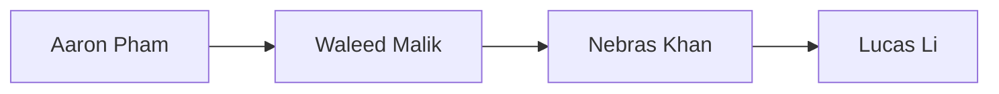

See also: [[DevelopmentPlan/DevelopmentPlan#Revision|this document revision]]

The following includes a brief roadmap of the development plan for `morph` from Team 23 (Hinterland).

## Confidential Information

There is no confidential information to protect for this project.

## IP to Protect

There is no IP to protect for this project.

## Copyright License

`morph` is licensed under the [Apache-2.0](https://github.com/aarnphm/morph/blob/main/LICENSE) license.

## Team Meeting Plan

Meeting will be run into two formats: Standup and Supervisor Meeting

| Meeting Type              | Frequency | Time (EST)      | Day    | Location                        | Agenda                                                                                                                                                            |
| ------------------------- | --------- | --------------- | ------ | ------------------------------- | ----------------------------------------------------------------------------------------------------------------------------------------------------------------- |
| Standup                   | Weekly    | **17:30-18:30** | Monday | Online via Teams                | • Round table format • What are you working on • Blockers? • Plan for this week                                                                          |
| Supervisor (w/ Dr.Mishra) | Monthly | **15:00-16:00** | Friday | In person, at arranged location | • Progress update • Discussion regarding relevant research and potential solutions for UX interaction • Q&A session for any issues during development cycle |

Meeting chairs and notetakes will be responsible for ensuring that given issues are filled out.
For meeting with supervisors, notes should be taken under [[meetings]].

Roles assignment can be found under [[DevelopmentPlan/DevelopmentPlan#Team Member Roles|Team Member Roles]].

Additional meetings can also be held as needed (knowledge sharing, coworking, etc.)

## Team Communication Plan

Hinterland members will use Teams for all asynchronous and synchronous communication.

Additionally, GitHub [issue tracker](https://github.com/aarnphm/morph/issues) should be used for feature
development. The Sprint [Kaban](https://github.com/users/aarnphm/projects/4?query=sort:updated-desc+is:open) board will
also be used concurrently for tracking tasks and in-progress work.

Expectations among team members with regards response to issues and pull requests assignments should be resolved within
1-2 business days. Should any issues arise that prevents members from using any of the aforementioned communication
methods, Email should be used to communicate with the rest of the team and the instructor.

## Team Member Roles

The following encapsulates member roles for Hinterland.

[Aaron Pham](https://aarnphm.xyz) will serve as the Project Lead, responsible for coordinating all aspects of the project. This includes managing communication with course instructors and the project supervisor, setting priorities, facilitating team alignment, and supporting other members across different components.

Notetakers will be responsible for taking notes during meetings, lectures during the working week, and this role will
be rotated among team members on a four week basis. The following can be used:

> [!note] Meeting chair assignment
> Follow the schedule for notetakers.

Given that `tinymorph` consists of both a web-based editor and an ML inference server, the following team members will take primary responsibility for each area:

- Interface design: Collaborative design process led by [Aaron Pham](https://aarnphm.xyz).
- Web-based editor: [Nebras Khan](https://github.com/nebrask).
- ML inference server: [Waleed Malik](https://github.com/waleedmalik7)
- SAE intervention: Led by [Aaron Pham](https://aarnphm.xyz), with support from [Lucas Li](https://github.com/lucas-lizhiwei)

Code reviewers will be assigned based on ownership of the component in question. Team members are encouraged to collaborate across components as needed.

> [!note] Assignment
> While responsibilities are divided for clarity, all members are free to contribute across components depending on project needs.

## Workflow Plan

Tinymorph follows a conventional Git workflow. The `main` branch acts as the production-ready branch. All changes must be submitted via pull requests, and PRs will be squash-merged into a single commit to maintain a clean, linear history.

### Commit and Branch Naming

Commit messages and branch names will use short, descriptive prefixes based on the type of work. Common tags include:
- `feat:` for new features
- `docs:` for documentation changes
- `infra:` for infrastructure or CI updates
- `chore:` for cleanup, config, or non-functional changes

### Issue Tracking

We use GitHub Issues for all tasks, bugs, planning items, and meetings. The following templates are available to guide issue creation:

- **Bug Report**: For reporting issues and unexpected behavior  
- **Feature Request**: For proposing and discussing new features  
- **Lecture**: To track course lecture-related notes  
- **Peer Review**: To manage external reviews of deliverables  
- **Supervisor Meeting**: To prepare and document supervisor meetings  
- **TA Meeting**: For tracking TA check-ins or sync-ups  
- **Team Meeting**: For internal team meetings and agendas  
- **Blank**: For anything that doesn’t fit the above categories

Issues will be labeled appropriately (`feat`, `docs`, `infra`, `lecture`, `meeting`, etc.) and assigned to team members as needed. Milestones may be used to track key deliverables.

### Project Board Workflow

Each issue is tracked on the GitHub project board using the following status columns:

- **Backlog**: Task not yet started  
- **Ready**: Task ready to be picked up  
- **In progress**: Task currently being worked on  
- **In review**: Task is under code or design review  
- **Done**: Task is completed

This helps visualize team progress and maintain async alignment.

### Pull Request Process

- All PRs must reference a related issue when applicable  
- Code reviews are required before merging  
- PRs must pass CI checks (tests and formatting)  
- Small, focused changes are preferred

### CI/CD via GitHub Actions

CI/CD is automated using GitHub Actions. The setup includes:
- **Docs Deployment**: Automatically triggered on pushes to `main` and pull requests  
- **Component CI Pipelines**: Each main module (editor, inference server) has a dedicated workflow for testing and formatting  
- **Support for A/B Testing**: Will be used for evaluating model variants or steering interventions

This setup ensures transparency, quality, and efficient iteration throughout development.

## Project Decomposition and Scheduling

[Kaban](https://github.com/users/aarnphm/projects/4?query=sort:updated-desc+is:open) board through GitHub Projects will
be used for tracking tasks and deadlines. This board should already include certain triage, milestones, as well as
deadlines accordingly to course outline.

Additional features and functionalities will be added incrementally to the Kaban board.

See also [[Scratch|brain dump]] for more detailed features development.

## Proof of Concept Demonstration Plan

The following outlines the proof-of-concept (POC) plan for `tinymorph` leading up to the November deadline:

- A functional web-based text editor with initial support for feature steering and interactive suggestions  
- Use of [Gemma 2](https://ai.google.dev/gemma?authuser=2) with pretrained [[glossary#sparse autoencoders|SAEs]] (see [GemmaScope](https://ai.google.dev/gemma/docs/gemma_scope)) to demonstrate early feature-steering capabilities  
- Begin training custom SAEs for `Llama 3.1` to support future expansion  
- Run an OpenAI-compatible inference API server, hosted remotely on BentoCloud  
- Introduce optional Vim-mode for advanced users familiar with modal editing

### Risks and Challenges

The following risks may impact the success or performance of the POC:

- Degradation in generation quality if feature steering is poorly configured, resulting in irrelevant or incoherent suggestions  
- Performance issues when rendering live inlays directly in the text editor, potentially affecting responsiveness  
- Incomplete or non-functional modal editing (Vim-mode) by the POC deadline  
- Complexity of full-system (end-to-end) testing, due to the multiple moving parts in `tinymorph` (frontend, backend, and model control logic)  
- Slow initial response from the model server (cold starts), especially in remote deployment  
- Instability from mismanaging KV cache within the `vLLM` block manager when modifying attention activations directly

### Mitigation Strategies

To reduce the impact of the above risks, we plan to:

- Propose and test a low-fidelity prototype early, followed by iterative design improvements to address usability issues  
- Focus UX efforts on refining critical interactions to ensure stability during the POC demo  
- Train a small set of [[glossary#low-rank adapters|LoRA]] as a fallback to merge with `Llama 3.1`, using methods proven in industry for reliability  
- Delay low-level memory tuning until a stable version of the model is running, to avoid interrupting key demo features

## Expected Technology

See also [CONTRIBUTING.md](https://github.com/aarnphm/morph/blob/main/CONTRIBUTING.md) and [[DevelopmentPlan/DevelopmentPlan#Coding Standard|Style]]

The following stack will be divided into two parts: web-based editor (morph) and ML inference server (asteraceae)

No plans for code coverage, as it is usually a waste-of-time early on. Development will be tracked through `git`,
`GitHub`, as well as GitHub Projects for sprint progress.

Editor of choice should depends on whatever is the one that makes you move the fastest. For me, it is [Neovim](https://neovim.io/)

### documentation

Generated with [Quartz](https://quartz.jzhao.xyz/), hosted on GitHub Pages.

One can use any file-based markdown editor to update documentation, but recommend to use [Obsidian](https://obsidian.md/)

Design file will be using [Figma](https://figma.com) for high-fidelity prototype, [Excalidraw](https://excalidraw.com/)
for low-fidelity prototype.

Citations will use [Chicago Manual of Style](https://www.chicagomanualofstyle.org/tools_citationguide.html) with
a custom [CSL](https://github.com/aarnphm/morph/blob/main/docs/content/chicago-fullnote-bibliography.csl) for supporting footnotes

### web-based editor (morph)

Language: JS/TS

Stack:

- rendering: Any React-based framework, e.g. Next, w/ Node backend.
- styling: SASS, framer-motion, @shadcn/ui
- testing: Jest

Formatter: prettier

Linter: eslint

Bundler/Transpiler: vite/esbuild

CI: include styling and linter, possibly a small set of A/B tests.

tool: [`pnpm`](https://pnpm.io/) for monorepo workspace management

### ml inference server (asteraceae)

Language: Python

Stack:

- online inference: BentoML, vLLM, pydantic, Goodfire
- offline inference: [llama.cpp](https://github.com/ggerganov/llama.cpp)
- testing: pytest

Linter: ruff

CI: include styling and linter, regression testing, e2e testing.

Model: Gemma 2 for SAE exploration, Llama 3.1 for final models (for POC specifically, will also train a few LoRAs for writers tonality)

Tool: [`uv`](https://github.com/astral-sh/uv) for monorepo management

## Coding Standard

### TS/JS

[Google style guide](https://google.github.io/styleguide/) will be used.

All related tools has been setup corespondingly.

### Python

A variation of Google style guide for Python will be used.

![[DevelopmentPlan/style#The coding style|variation]]

---

## Appendix

### Revision

| Date          | Developer(s) | Change                           |
| ------------- | ------------ | -------------------------------- |
| Sept. 16 2024 | 0.0          | Initial skafolding               |
| Sept. 22 2024 | 0.1          | Initial POC and Development Plan |
| March 31 2025 | 0.2          | Renaming to `morph` for consistency |
| Apr. 1 2025   | 0.3      | Full document revision and restructuring |

### Reflection
1. Why is it important to create a development plan prior to starting the project?
2. In your opinion, what are the advantages and disadvantages of using CI/CD?
3. What disagreements did your group have in this deliverable, if any, and how did you resolve them?

  <a class="name" href="https://github.com/aarnphm">Aaron</a>

1. It is important to create a development plan prior to starting the project to ensure goal alignment, timelines,
required resources and potential risks are evaluated accordingly. It enables better team coordination and planning on
feature development, as well as providing a baseline to measure progress against. Additionally, it also helps with
preventing scope creep by clearly defining goals and objectives to be achieved.

2. CI/CD, ensures faster development iterations and improve code quality through automated testing. It also
helps with earlier bug detection and prevent regressions. However, depending on the stage of the project (given that
morph is relatively new and small), setting CI/CD is a huge hassle as one will have to manage the infrastructure
as well as complexity of these pipelines. This will actually inversely introduce a lot of technical debt and slow down
development cycle. This is also known as _premature optimisation_.

> CI/CD is the case of "pick your poison"

3. We had a bit of disagreement around certain parts of the tech stack early on, particularly when choosing between different model-serving options. To resolve it, I made sure to ask for everyone’s input and facilitate a group discussion. In the end, we let the project champion for that component make the final call, which helped move things forward. Once the reasoning was clear, everyone supported the final decision, and it helped us shift focus toward building rather than debating.

 

  <a class="name" href="https://github.com/nebrask">Nebras</a>

1. Creating a development plan was crucial for us because it gave the project direction and helped us identify unknowns early on. We were able to break down a pretty ambitious idea like tinymorph into manageable parts, each with clear owners. It also helped the team align on expectations around responsibilities and workflows. Without this step, we could’ve easily drifted or miscommunicated, especially with a project that combines frontend UX and backend ML infrastructure. Having it all written down gave us similar to a shared guidebook.

2. CI/CD brings a lot of structure and confidence to our workflow. Every time we push, we get immediate feedback through automated tests and formatting checks, which is especially important with a project as modular as tinymorph. It also makes merging and deploying smoother since we’re never sitting on untested code. The downside is the initial time investment. Setting up the pipelines to work across the editor and ML inference layers wasn’t trivial. Also when the pipelines break, it can block progress temporarily until we debug them.

3. We had a bit of debate around how to define roles in the document. At first, we used the term “BDFL” to describe project leadership, but not everyone felt that term was appropriate for a formal academic deliverable. Some saw it as potentially off-putting or unclear to non-technical readers. After discussing it together, we switched to clearer language like “project lead” and emphasized shared ownership across components. That small change made the roles more understandable and professional without changing the actual structure of the team.

 

  <a class="name" href="https://github.com/waleedmalik7">Waleed</a>

1. A development plan sets the foundation for everything that follows. For tinymorph, we have both technical depth and user-facing complexity, and without planning ahead we might’ve prioritized the wrong things. Writing it all down forced us to clarify who is doing what, how our components talk to each other, and where potential risks lie. It also helped us have discussions early about scope, feasibility, and user expectations. I think having this plan will make future collaboration smoother and help when we check back in during project milestones.

2. CI/CD is amazing for speeding up collaboration. It lets us validate work continuously, rather than relying on big manual testing rounds. For example, documentation gets built automatically, and model-related checks run on every pull request. It gives us trust in our changes. That said, it takes work to maintain. We had to split the pipelines for different components and set guardrails so nothing breaks unexpectedly. It’s also easy to underestimate how much debugging CI issues can slow us down, especially if you're trying to fix a flaky test or inconsistent runtime.

3. We had different ideas on how much technical detail to include in certain sections, like the Proof of Concept plan. Some of us preferred shorthand to keep it concise, but others argued for more explanation. We ended up rewriting those sections with clarity in mind so that non-technical readers could follow along too.

 

  <a class="name" href="https://github.com/lucas-lizhiwei">Lucas</a>

1. Without a plan, a project like tinymorph would be way harder to manage. We have machine learning components, real-time UI interactions, and infrastructure decisions all happening in parallel. The plan helped us map out how everything fits together and what needs to happen first. It also helped reduce misunderstandings, especially around responsibilities. For instance, once we wrote out who was handling the editor vs. the ML inference server, it helped people focus on their parts while still being able to contribute to other areas.

2. The main advantage is that it catches problems early and keeps the team from stepping on each other’s toes. If a change breaks the build or causes formatting issues, we find out right away. That’s huge when you're working across frontend and backend. On the downside, CI/CD systems can be a bit opaque when they fail. It sometimes takes longer than expected to track down the root cause of a failing pipeline, especially if it’s something that works locally but not in the cloud environment. Still, the benefits outweigh the setup cost in the long run.

3. We had some small disagreements about how strict we wanted our Git workflow to be. Some people preferred a looser, more informal style while others wanted structure with squash merges, labels, and issue linking. In the end, we agreed to use structured naming and squash merging to keep our history clean but allowed for flexibility with how issues are created. It was a good compromise that let us be productive without overengineering the process.

<!-- 1. Why is it important to create a development plan prior to starting the project? -->
<!-- 2. In your opinion, what are the advantages and disadvantages of using CI/CD? -->
<!-- 3. What disagreements did your group have in this deliverable, if any, and how did you resolve them? -->

### Team Charter

borrows from [University of Portland Team Charter](https://engineering.up.edu/industry_partnerships/files/team-charter.pdf)

#### External Goals

Take a step back, our goal for `morph` is to imagine what machine-assisted interfaces for creative writing would look like[^1].

[^1]: [[ProblemStatementAndGoals/ProblemStatement#Problem|problem statement.]]

There are two narratives emerging from industry practitioners and companies with regards to the [intelligence age](https://ia.samaltman.com/): Entities that seek to build systems capable of outperforming
at tasks that a human can do at a greater degree of accuracy and efficiency. These companies include OpenAI, Anthropic, [SSI](https://ssi.inc/), many AI labs, etc.
and often disguised these systmems under the term "artificial super intelligence" (ASI). On the other end of spectrum, we have
companies that build AI systems to amplify our abilities to create and improve efficiency for our work. Companies such
as [Runway](https://runwayml.com/), [Cohere](https://cohere.com/), etc belongs to this paradigm. ^intelligence

Our interests lie firmly on the second group, where we build tools that amplifies our agency. `morph` is the manifestation of these beliefs.

Additionally, during the journey of prototyping `morph`, we hope to use it as a playground to delve into the field of [[glosar#mechanistic interpretability]] as a pure research interests.

#### Attendance

##### Expectations

Every team member should be expected to attend all standup and supervisor meetings. For lectures, coresponding
notetaker should be present as a point of contact during lecture time.

Communication methods include asynchronous and synchronous, via Teams and Email if necessary.

##### Acceptable Excuse

Should anything urgent may arise, such as family matters or health issues, one should inform the team ASAP so that
everyone else can allocate and focus on covering the tasks at hand.

We hope to cultivate a healthy work culture where everyone is encouraged to prioritise their health and well-being. If
there are any specific concerns one should explicitly address with the whole team, or resolve the matter privately with
all concerned parties.

##### In Case of Emergency

What process will team members follow if they have an emergency and cannot attend a team meeting or complete their individual work promised for a team deliverable?

Please let everyone know through Teams, email Dr.Smith about this specific incident so that the others members can cover the team deliverable.

#### Accountability and Teamwork

##### Quality

What are your team's expectations regarding the quality of team members' preparation for team meetings and the quality of the deliverables that members bring to the team?

We expect all team members to try their best at constructing features works and contributions to documentation. Members
are expected to become the domain experts for topics that they are championing, while everyone else should understand
certain decisions and tradeoff behind design choices.

For meeting preparation, we expect everyone to come prepared with questions and discussion topics they want to do.

##### Attitude

Adhering to [Code of Coduct](https://github.com/aarnphm/morph/blob/main/.github/CODE_OF_CONDUCT.md) adapted from the [Contributor Covenant](https://www.contributor-covenant.org), [version 2.0](https://www.contributor-covenant.org/version/2/0/code_of_conduct.html).

We encouraged everyone to be open to new ideas and collaborate on features work. We should use constructive critism with regards doing review work.

Should any conflict arise, please discuss your concern and display your reasoning with the whole team, asynchronously or synchronously. At the end of the day, we are all humans 😀

##### Stay on Track

We will use standup [notes](https://github.com/aarnphm/morph/issues?q=is:issue+is:closed+meeting+) to keep track of everyone progress.

For metrics, try to show up for meetings, and push your progress through draft PR to show your current progression.

##### Decision Making

The team will follow a consensus-based voting model for feature design and implementation decisions.

In the event of a split vote, a final decision will be made by the team member responsible for that component.
