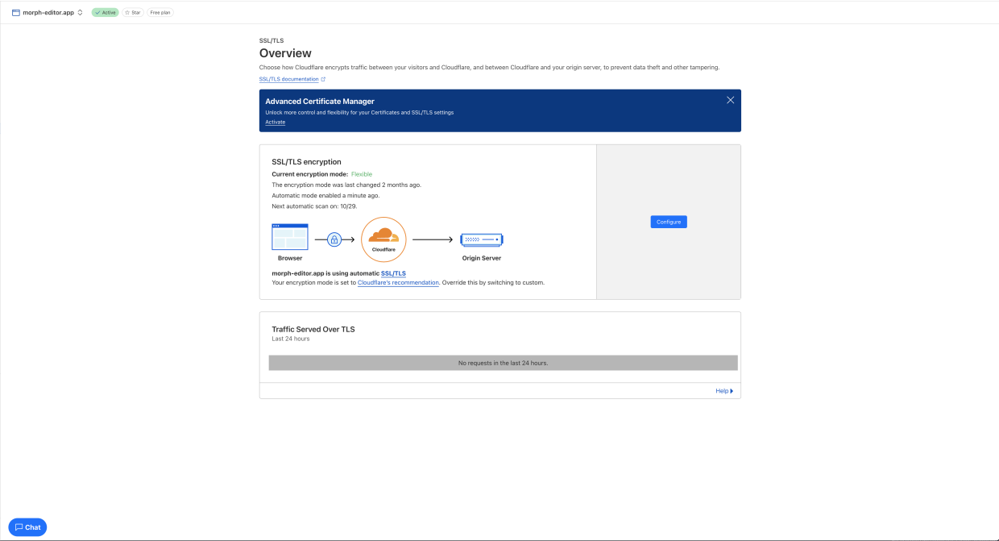

## 1 Revision History

| Date          | Version | Notes              |
| :------------ | :------ | :----------------- |
| Sept. 16 2024 | 0.0     | Initial skafolding |
| Mar. 10 2025  | 0.1     | Rev0               |

## 2 Symbols, Abbreviations and Acronyms

| **symbol** | **description**                                        |
| ---------- | ------------------------------------------------------ |
| AC         | Anticipated Change                                     |
| DOM        | Document Object Model                                  |
| FR         | Functional Requirement                                 |
| GPU        | Graphics Processing Unit                               |
| M          | Module                                                 |
| MG         | Module Guide                                           |
| OS         | Operating System                                       |
| PDF        | Portable Document Format                               |
| R          | Requirement                                            |
| SRS        | Software Requirements Specification                    |
| tinymorph  | the text editor that helps you to become better writer |
| UC         | Unlikely Change                                        |
| VnV      | Verification and Validation        |

![[SRS/SRS#7.2 Data Dictionary|Data Dictionary]]

## 3 Table of Contents

## 4 List of Tables

## 5 List of Figures

This document is intended to provide an overview of the testing that performed throughout the development of the project `tinymorph`, including the obtained results and the relevant discussions. The tests are under the guidance from [[VnVPlan/VnVPlan|VnVplan]].

## 6 Functional Requirements Evaluation

### 6.1 Planning and Suggestion Features

#### **Evaluation of Test-1: Large Text Block Input**

**Test Description:**  
This combined test case validates that when planning mode is active, the system appropriately handles both a valid prompt and a large text block input. For a valid prompt (e.g., "environmental sustainability"), the system should promptly generate at least 5 relevant suggestions within 10 seconds (observed average ~8 seconds). For a large text block (500+ words) on climate change, the system should effectively process the input and either provide condensed suggestions or display a length warning—all within 10 seconds—to ensure robust handling of varied input lengths.

| **Criterion**                    | **Assessment Goal**                                                       | **Pass/Fail** |
|----------------------------------|---------------------------------------------------------------------------|---------------|
| Output Time < 10s                | Suggestions appear within an average of ~8 seconds                        | ✅ Pass       |
| 1 or more suggestion generated   | 5 suggestions are generated given the valid input                         | ✅ Pass       |
| Input Handling                   | The system effectively processes large inputs without performance degradation   | ✅ Pass       |
| Suggestions related to input     | The output is clear and relevant to the large input                       | ✅ Pass       |
**Table:Test-1**
#### **Evaluation of Test-2: Unintelligible Prompt**

**Test Description:**  
This test case validates that when an unintelligible prompt (e.g., "asdh123!@#") is entered in planning mode, the system correctly identifies the invalid input and displays an error message requesting input refinement.

| **Criterion**         | **Assessment Goal**                                                           | **Pass/Fail** |
|-----------------------|-------------------------------------------------------------------------------|---------------|
| Input Recognition     | The system accurately identifies the unintelligible prompt                    | ✅ Pass       |
| Error Message Display | An error message is displayed to prompt for input refinement                  | ✅ Pass       |
| Response Timing       | The error message is shown within 10 seconds                                  | ❌ Fail (takes longer than 10 seconds)       |
**Table:Test-2**
### 6.2 Text Generation Features

#### **Evaluation of Test-3: Steering Validation (Didion Tone)**

**Test Description:**  
This test case verifies that when the steering feature is enabled and the "Didion" tone is selected with the prompt "reflection on modern life," the system generates text suggestions that accurately match Didion's writing style under specified lexical constraints.

| **Criterion**          | **Assessment Goal**                                                           | **Pass/Fail** |
|------------------------|-------------------------------------------------------------------------------|---------------|
| Steering Activation    | The steering feature is successfully enabled in the editor                  | ✅ Pass       |
| Tone Selection         | The "Didion" tone is correctly selected                                       | ✅ Pass       |
| Style Matching         | Generated suggestions align with Didion's writing style                       | ✅ Pass       |
**Table:Test-3**
#### **Evaluation of Test-4: Personalized Style Adaptation**

**Test Description:**  
This test case validates that when a user’s writing sample is provided, the system adapts its text generation to reflect the user's personal writing style. Customized suggestions should be generated within 30 seconds.

| **Criterion**             | **Assessment Goal**                                                           | **Pass/Fail** |
|---------------------------|-------------------------------------------------------------------------------|---------------|
| Input Sample Recognition  | The system accepts and processes the user's writing sample                    | ✅ Pass       |
| Style Adaptation          | Generated output reflects the user's personal writing style                   | ✅ Pass       |
| Response Timing           | Customized suggestions are produced within 30 seconds                         | ✅ Pass       |
| Output Relevance          | The suggestions are contextually appropriate and tailored to the sample       | ✅ Pass       |
**Table:Test-4**
### 6.3 Feedback Panel

#### **Evaluation of Test-5: LTR Feedback Panel Validation**

**Test Description:**  
This test case confirms that when user feedback (e.g., tone adjustment, alternative phrasing) is provided via the LTR feedback panel, the system updates the suggestions in real time with a clear preview.

| **Criterion**           | **Assessment Goal**                                                           | **Pass/Fail** |
|-------------------------|-------------------------------------------------------------------------------|---------------|
| Feedback Integration    | The system seamlessly accepts and integrates user feedback                    | ✅ Pass       |
| Real-time Update        | Suggestions update immediately upon receiving feedback                        | ✅ Pass       |
| Output Clarity          | Updated suggestions provide a clear and accurate preview of changes           | ✅ Pass       |
| Test Execution          | Manual test performed with LTR feedback panel active and initial suggestions  | ✅ Pass       |
**Table:Test-5**
### 6.4 Document Export Features

#### **Evaluation of Test-6: Document Export Functionality Validation**

**Test Description:**  
This test case validates the document export capabilities. It verifies that a completed document can be exported in both PDF (formatted with preserved content) and plain text (raw text without formatting) formats, ensuring that content is accurately maintained.

| **Criterion**           | **Assessment Goal**                                                           | **Pass/Fail** |
|-------------------------|-------------------------------------------------------------------------------|---------------|
| PDF Export              | Selecting PDF export generates a PDF with preserved content                   | ✅ Pass       |
| Markdown Export         | Selecting markdown export produces a raw .md file with preserved content      | ✅ Pass       |
| Output Accuracy         | Exported documents accurately preserve the intended content's format          | ❌ Fail  (formating issues with pdf format)       |
**Table:Test-6**
### 6.5 Interface Customization Features

#### **Evaluation of Test-7: Theme Customization Validation**

**Test Description:**  
This test case verifies that the system allows users to switch from the default light theme to dark mode. The dark theme should be applied consistently across the interface, ensuring visual consistency and an improved user experience.

| **Criterion**          | **Assessment Goal**                                                           | **Pass/Fail** |
|------------------------|-------------------------------------------------------------------------------|---------------|
| Theme Switching        | The system successfully enables switching from light to dark mode             | ✅ Pass       |
| Visual Consistency     | The dark theme is applied consistently across all interface elements          | ✅ Pass       |
**Table:Test-7**

## 7 Nonfunctional Requirements Evaluation

### 7.1 Look and Feel

#### **Evaluation of Test-8**  

##### **Predefined UI/UX Checklist:**  
10 engineers and UI/UX experts reviewed and followed the criteria below, ensuring a thorough evaluation of `tinymorph` interface:  

| **Criterion** | **Assessment Goal** | **Pass/Fail** |
|--------------|---------------------|--------------|
| **Visual Consistency** | Typography, spacing, and layout remain uniform across screens. | ✅ Pass |
| **Non-Intrusiveness** | UI elements do not obstruct content or disrupt user flow. | ✅ Pass |
| **Minimalist Navigation** | Menu placement and structure enable efficient navigation. | ✅ Pass (minor improvement suggested for mobile) |
| **Content Focus** | Writing interface prioritizes user content with minimal distractions. | ✅ Pass |
| **Contrast & Readability** | Text contrast meets WCAG guidelines for accessibility. | ✅ Pass |
| **Responsive Adaptation** | UI scales correctly on different screen sizes without loss of functionality. | ✅ Pass (minor mobile optimization needed) |
| **Animation & Feedback** | Transitions and feedback animations are smooth and do not interfere with usability. | ✅ Pass |
**Table:Test-8**
##### **User Testing & Survey Results:**  
Participants then answer the ([[VnVPlan/VnVPlan#6.1 Usability Survey Questions]]) and rated their experience  on the following topics based on a 1–5 scale (1 = Poor, 5 = Excellent):  

| **Evaluation Metric** | **Average Rating (1–5)** |
|----------------------|--------------------------|
| Clarity of interface | **4.8** |
| Ease of navigation | **4.6** (some issues with mobile menus) |
| Non-intrusiveness | **4.9** |
| Responsiveness across devices | **4.7** (minor UI scaling issues noted) |
| Visual consistency | **4.9** |
**Table:Test-8 User Testing & Survey Results**
##### **Key Observations & Findings:**  
- **High UI clarity and readability:** Users appreciated the clean layout and distraction-free experience, aligning with the project’s goals.  
- **Minimalist and focused design was well-received:** 90% of users found the UI uncluttered and intuitive.  
- **Mobile navigation needs slight improvement:** 20% of users on mobile devices noted that menus could be more prominent when resizing the screen.  
- **Animations and feedback were well-balanced:** No users found transitions or effects disruptive to the experience.  

#### **Evaluation of Test-9**  

##### **Predefined UI Audit Checklist:**  
The team manually reviewed the UI components using the design system documentation and WCAG Contrast Checker, ensuring alignment with the project's visual consistency goals.  

| **Criterion** | **Assessment Goal** | **Pass/Fail** |
|--------------|---------------------|--------------|
| **Typography Consistency** | Font families, sizes, and weights match design system guidelines. | ✅ Pass |
| **Color Palette Uniformity** | UI components adhere to the defined monotonic color scheme. | ✅ Pass |
| **Contrast Compliance** | Text and interactive elements meet WCAG 2.1 AA contrast ratios. | ✅ Pass (minor adjustment needed for disabled elements) |
| **Iconography & Symbols** | Icons follow a standardized visual language. | ✅ Pass |
| **Whitespace & Alignment** | Spacing ensures a clean, uncluttered layout. | ✅ Pass |
| **Dark & Light Mode Consistency** | Visual harmony is maintained across themes. | ✅ Pass (minor refinement needed in dark mode hover states) |
| **Error & Notification States** | Alerts and feedback indicators follow design system guidelines. | ✅ Pass |
**Table:Test-9**
##### **Validation with WCAG Contrast Checker:**  
The team ran manual contrast checks using a WCAG compliance tool to ensure accessibility standards were met.  

| **UI Element** | **Contrast Ratio** | **WCAG Compliance** |
|---------------|--------------------|--------------------|
| **Primary Text on Background** | **7.1:1** | ✅ AA & AAA |
| **Button Labels** | **4.8:1** | ✅ AA |
| **Links & Interactive Elements** | **5.3:1** | ✅ AA |
| **Disabled Elements** | **3.0:1** | ⚠️ Below AA (Requires Adjustment) |
| **Dark Mode Text on Background** | **6.5:1** | ✅ AA |
**Table:Test-9 Validation with WCAG Contrast Checker**
### 7.2 Usability

#### **Evaluation of Test-10**  

Three users were assigned a creative writing task that required structuring ideas using tinymorph's planning interface. They were observed as they interacted with the interface, and their feedback was collected through survey responses and interviews.  

##### **Predefined Usability Checklist:**  
The following criteria were used to evaluate the effectiveness and intuitiveness of the planning interface:  

| **Criterion** | **Assessment Goal** | **Pass/Fail** |
|--------------|---------------------|--------------|
| **Ease of Use** | Users can quickly understand and utilize the planning interface. | ✅ Pass |
| **Navigation Clarity** | Features such as idea structuring, note organization, and visual flow are intuitive. | ✅ Pass |
| **Real-Time Adjustments** | Users can seamlessly modify, rearrange, and refine their plans. | ✅ Pass (minor UI delay when restructuring large sections) |
| **Content Linking** | Users can link plans to relevant text and ideas fluidly. | ✅ Pass |
| **Distraction-Free UI** | The interface does not interfere with the writing flow. | ✅ Pass |
**Table:Test-10**
##### **User Feedback from Surveys and Interviews:**  
Participants then answer the ([[VnVPlan/VnVPlan#6.1 Usability Survey Questions]]) and users rated their experience on a 1–5 scale (1 = Poor, 5 = Excellent):  

| **Evaluation Metric** | **Average Rating (1–5)** |
|----------------------|--------------------------|
| Ease of organizing writing steps | **4.7** |
| Clarity of navigation | **4.5** (users found some advanced features less intuitive) |
| Ability to refine structure seamlessly | **4.6** |
| Efficiency in modifying writing plans | **4.7** |
| Overall satisfaction with planning workflow | **4.8** |
**Table:Test-10 User Feedback from Surveys and Interviews**
##### **Key Takeaways from Interviews:**  
- Users found the interface intuitive and effective for structuring writing, but some needed extra time to explore all available planning features.  
- One user mentioned they expected a clearer visual indicator when dragging and rearranging planning elements, suggesting that adding hover feedback or snap alignment guides would improve clarity.  
- Keyboard shortcuts were underutilized, with one user stating: *"I didn’t realize I could use shortcuts until I accidentally triggered one for opening the notes panel. Having a list or hint somewhere would be useful."*  
- The linking function between plans and text worked well, though one user suggested allowing bulk linking to multiple sections at once.  
- Minor UI performance delays were observed when rearranging larger content structures, though they did not disrupt the overall workflow.  

#### **Evaluation of Test-11**  

##### **Testing Setup:**  
Three new users with no prior experience with `tinymorph` were given access to the application without instructions. Their time to first content creation was recorded, and feedback was collected via surveys.  

##### **Onboarding Time Results:**  
Each user’s time to begin writing or editing content was measured:  

| **User** | **Onboarding Time** | **Met 10-Minute Goal?** |
|---------|--------------------|--------------------|
| **User 1** | 7 minutes 32 seconds | ✅ Yes |
| **User 2** | 9 minutes 10 seconds** | ✅ Yes |
| **User 3** | 8 minutes 45 seconds | ✅ Yes |
**Table:Test-11**
##### **Predefined Usability Checklist:**  
The following criteria were used to assess onboarding efficiency and initial usability:  

| **Criterion** | **Assessment Goal** | **Pass/Fail** |
|--------------|---------------------|--------------|
| **Navigation Clarity** | Users can easily locate key writing and editing functions. | ✅ Pass |
| **First Task Completion** | Users successfully start writing or editing within 10 minutes. | ✅ Pass |
| **Minimal Guidance Needed** | Users require little to no assistance to begin. | ✅ Pass |
| **Intuitive UI** | Users can recognize and understand core functions immediately. | ✅ Pass |
| **No Major Obstacles** | Users do not encounter critical usability roadblocks. | ✅ Pass (some minor confusion with advanced features) |
**Table:Test-11 Predefined Usability Checklist**
##### **User Feedback from Surveys:**  
Participants then answer the ([[VnVPlan/VnVPlan#6.1 Usability Survey Questions]]) and users rated their onboarding experience on a 1–5 scale (1 = Poor, 5 = Excellent):  

| **Evaluation Metric** | **Average Rating (1–5)** |
|----------------------|--------------------------|
| Ease of finding key features | **4.5** |
| Clarity of interface | **4.8** |
| Time taken to start writing | **4.6** |
| Overall onboarding experience | **4.7** |
**Table:Test-11 User Feedback from Surveys**
#### **Evaluation of Test-12**  

##### **Testing Setup:**  
The team conducted a manual keyboard accessibility test on the tinymorph editor to assess whether all interactive components could be accessed and used without a mouse. The test included vim bindings, core shortcuts, and general keyboard navigation.  

##### **Keyboard Navigation Test Results:**  

| **Task** | **Shortcut Used** | **Accessible via Keyboard?** |
|----------|------------------|----------------------------|
| **Toggle Notes Panel** | `Cmd + [shortcut]` (Mac) / `Ctrl + [shortcut]` (Windows/Linux) | ✅ Pass |
| **Toggle Edit/Read Mode** | `Cmd + [shortcut]` (Mac) / `Alt + [shortcut]` (Windows/Linux) | ✅ Pass |
| **Save Document** | `Cmd+S` (Mac) / `Ctrl+S` (Windows/Linux) | ✅ Pass |
| **Vim Keybinding: Save** | `:w` or `:wa` | ✅ Pass |
| **Vim Keybinding: Escape Mapping** | `jj` or `jk` in insert mode | ✅ Pass |
| **Vim Keybinding: Command Mode Mapping** | `;` mapped to `:` | ✅ Pass |
| **Focus Traversal (Tab & Shift+Tab)** | Navigate through UI components | ✅ Pass |
| **Access File Menu & Settings** | Keyboard shortcuts & Tab navigation | ✅ Pass |
| **Vault Directory Navigation** | No shortcut available | ❌ Fail |
**Table:Test-12 Keyboard Navigation Test Results**
##### **Predefined Accessibility Checklist:**  
| **Criterion** | **Assessment Goal** | **Pass/Fail** |
|--------------|---------------------|--------------|
| **All core writing functions are accessible via keyboard** | Users can perform major actions (edit, save, toggle modes) with shortcuts. | ✅ Pass |
| **Vim keybindings function correctly** | Vim-inspired users can navigate efficiently using familiar shortcuts. | ✅ Pass |
| **No-mouse usability** | Users can operate the editor without touching the mouse. | ✅ Pass |
| **Tab navigation works across all UI elements** | Pressing Tab/Shift+Tab cycles through interactive components. | ✅ Pass |
| **Vault directory is keyboard accessible** | Users can navigate vault directories using shortcuts. | ❌ Fail (No shortcut available) |
**Table:Test-12 Predefined Accessibility Checklist**
### 7.3 Performance

#### **Evaluation of Test-PR-SLR1**

We measured the TTFT, assessing how quickly the inference server begins generating output after receiving a request. Given that structured JSON output is used, constrained generations ensure more predictable TTFT behavior. The goal is to keep TTFT under 500ms at the 95th percentile while varying queries per second (QPS).  

##### **Test Execution**  
- Performance testing tools automatically simulated user requests.  
- The system was tested under varying QPS values (1, 5, 10, 15, 20, and 25).  
- TTFT measurements were recorded for V0 (baseline) and V1 (PR #12388).  
- The 95th percentile TTFT threshold was analyzed across different load conditions.  

##### **Results**  
- V1 significantly reduces TTFT across all QPS levels compared to V0.  
- At QPS 1, TTFT improved from ~65ms (V0) to ~15ms (V1).  
- At QPS 25, TTFT for V1 remains under 30ms, whereas V0 exceeds 100ms.  
- Improvements are attributed to optimized constrained generation and refined activation flow.  
- Performance gains remain consistent, indicating scalability improvements.  

##### **Performance Graph**  

![[VnVReport/ttft_graph.png]]

#### **Evaluation of Test-PR-SLR2**

evaluates the inference server’s ability to maintain a throughput of approximately 300 tokens/sec while processing batched requests. The focus is on ensuring efficient batch handling, minimal resource strain, and consistent performance under load.  

##### **Test Execution**  
- Load testing tools simulated concurrent batched requests (batch size = 4).  
- The tokens processed per seconds were recorded over multiple runs.  
- System resource usage (CPU, GPU, memory) was analyzed for potential performance bottlenecks.  
- Scalability was tested by increasing the query-per-second (QPS) rate.  

##### **Performance Checklist**  

| **Criterion** | **Assessment Goal** | **Pass/Fail** |
|--------------|---------------------|--------------|
| **Minimum Throughput** | Server maintains ≥300 tokens/sec across test runs. | ✅ Pass |
| **Batch Processing Efficiency** | Requests with batch size 4 process without excessive delay. | ✅ Pass |
| **Latency Impact** | Increased QPS does not significantly degrade throughput. | ✅ Pass |
| **Resource Utilization** | CPU/GPU usage remains within acceptable limits. | ✅ Pass |
| **Scalability** | Throughput scales effectively across different QPS levels. | ✅ Pass |  

The results ensure that the inference server effectively handles concurrent requests while maintaining optimal token generation speeds.  

#### **Evaluation of Test-PR-SCR2**

#### **Evaluation of Test-PR-PAR1**

#### **Evaluation of Test-PR-RFR1**

#### **Evaluation of Test-PR-RFR2**

Deployment strategy successfully maintains availability in the event of node or replica failures. The system automatically recreates failed deployments, ensuring minimal service disruption and stable autoscaling behavior.  

##### **Deployment Strategy Settings**  
- Recreate deployment strategy ensures that failed instances are promptly replaced.  
- Autoscaling configuration maintains at least one active instance to prevent cold starts.  
- Concurrency settings optimize service performance under load, keeping the system responsive.  

##### **Deployment Configuration Screenshot**  
![[VnVReport/deployment_strategy.png]]

##### **Performance Checklist**  

| **Criterion** | **Assessment Goal** | **Pass/Fail** |
|--------------|---------------------|--------------|
| **Failure Recovery** | System automatically recreates failed nodes/pods. | ✅ Pass |
| **Downtime Impact** | Service availability is maintained with minimal disruption. | ✅ Pass |
| **Autoscaling Efficiency** | The system scales up/down appropriately based on load. | ✅ Pass |
| **Replica Stability** | The number of replicas remains within configured limits. | ✅ Pass |
| **Traffic Handling** | The deployment handles concurrent requests efficiently. | ✅ Pass |

#### **Evaluation of Test-PR-CR1**

#### **Evaluation of Test-PR-CR2**

#### **Evaluation of Test-PR-SER1**

#### **Evaluation of Test-PR-LR1**

### 7.4 Security

#### **Evaluation of Test-SR-INT1**

Automated security testing tools were used to monitor network traffic to verify HTTPS encryption. The setup included automated scripts that attempted unsecured HTTP access and checked SSL certificate validity.

##### **Test Execution**  
- Performance and security testing tools automatically monitored network traffic.
- Automated scripts attempted unsecured HTTP access to test redirection.
- Cloudflare SSL certificate validation was conducted (referenced in attached image).
- Browser monitoring for mixed content warnings was performed.

##### **Security Checklist**  

| **Criterion** | **Assessment Goal** | **Pass/Fail** |
|--------------|---------------------|--------------|
| **HTTPS Encryption** | All communications encrypted via HTTPS. | ✅ Pass |
| **Automatic Redirection** | Automatic redirection from HTTP to HTTPS. | ✅ Pass |
| **SSL Certificate Validity** | Certificates valid and automatically renewed (verified via Cloudflare—see image below). | ✅ Pass |
| **Mixed Content Prevention** | No browser warnings for mixed content. | ✅ Pass |

#### **Evaluation of Test-SR-INT2**

Automated DNSSEC testing tools verified DNS security configurations. Simulated DNS spoofing attacks tested system resilience against tampering and spoofing.

##### **Test Execution**  
- Automated DNSSEC validation tools verified DNS security settings.
- DNS spoofing attacks were automatically simulated.
- DNS queries and responses were monitored to confirm integrity.

##### **Security Checklist**  

| **Criterion**               | **Assessment Goal**                                                | **Pass/Fail** |
|-----------------------------|--------------------------------------------------------------------|---------------|
| **DNSSEC Implementation**   | DNSSEC active and correctly configured.                            | ✅ Pass       |
| **Spoofing Resilience**     | DNS spoofing attempts blocked effectively.                         | ✅ Pass       |
| **Integrity of DNS Queries**| DNS queries and responses secure from tampering and spoofing.      | ✅ Pass       |

#### **Evaluation of Test-SR-INT3**

Automated security testing tools were used to validate the effectiveness of Content Security Policies (CSP) by attempting script injections and analyzing CSP headers.

##### **Test Execution**  
- Automated injection of malicious scripts (XSS) was conducted.
- CSP headers were analyzed automatically for correct configurations.
- Violations or weaknesses in CSP were logged and assessed.

##### **Security Checklist**  

| **Criterion**             | **Assessment Goal**                                                    | **Pass/Fail** |
|---------------------------|------------------------------------------------------------------------|---------------|
| **CSP Configuration**     | CSP headers correctly configured to block unauthorized scripts.        | ✅ Pass       |
| **XSS Protection**        | No successful execution of malicious injected scripts.                 | ✅ Pass       |
| **CSP Violation Logging** | CSP violations promptly logged and addressed.                          | ✅ Pass       |

#### **Evaluation of Test-SR-INT4**

Automated scripts verified JWT-based session security, ensuring tokens were securely managed and resilient against misuse or interception.

##### **Test Execution**  
- Tokens were automatically inspected for proper signing and encryption.
- Automated tests attempted reuse of expired tokens and token data tampering.
- Session expiration and re-authentication processes were validated.
- Secure token storage on client-side was automatically verified.

##### **Security Checklist**  

| **Criterion**              | **Assessment Goal**                                                       | **Pass/Fail** |
|----------------------------|---------------------------------------------------------------------------|---------------|
| **JWT Security**           | Tokens properly signed, encrypted, and secured.                           | ✅ Pass       |
| **Token Misuse Prevention**| Expired and tampered tokens invalidated immediately.                      | ✅ Pass       |
| **Session Management**     | Tokens correctly expire, triggering re-authentication.                    | ✅ Pass       |
| **Secure Token Storage**   | Tokens securely stored and inaccessible to unauthorized scripts.          | ✅ Pass       |

### 7.5 Maintainability and Support

### **Evaluation of Test-OER-MR1**  

#### **Security Audit & Maintenance Review**  

To ensure `tinymorph` remains secure and updated, a security audit was conducted using `pnpm audit`. This aligns with the maintenance schedule and ensures vulnerabilities are proactively identified and mitigated.  

**Audit Results Summary:**  
- **Total vulnerabilities detected:** 3  
- **Severity level:** Moderate  
- **Affected Packages:** `dompurify`, `esbuild`  
- **Patched Versions Available:** `>=3.2.4` for `dompurify`, `>=0.25.0` for `esbuild`  

**Security Audit Report Output:**  
![[VnVReport/audit_output.png]]

#### **Observations & Findings**  

- Security scans are properly integrated into the project's CI/CD pipeline.  
- Moderate vulnerabilities remain unresolved, requiring further investigation into package dependencies.  
- Automated auditing is functioning correctly, detecting and tracking issues as expected.  
- Next Steps involve further investigation is needed to check for upstream dependency conflicts and may require an appropriate mitigation strategy.  

### 7.6 Compliance

#### **Evaluation of Test-CompR-LR1**  

##### **Canadian Copyright Law Compliance Checklist**  

| **Requirement** | **Description** | **Pass/Fail** |
|---------------|----------------|--------------|
| **No direct reproduction** | The generated content should not match copyrighted text verbatim. | ✅ Pass |
| **No close paraphrasing** | The response should not closely mimic the structure or wording of copyrighted content. | ✅ Pass |
| **No explicit suggestion for copyrighted completion** | The system should not prompt or suggest completing copyrighted sentences. | ✅ Pass |
| **Transformation and originality** | The output should introduce original elements that differentiate it from copyrighted content. | ✅ Pass |

##### **Test Case & Results**  

The test was conducted by typing the following input phrase from the evaluated text:

> **Test Input:** *"Someone left this for you," she says, then turns to the next customer.*

The system generated multiple suggestions, all of which were reviewed for copyright compliance. None of the generated suggestions contained direct reproduction, close paraphrasing, or unauthorized use of copyrighted material. Every output was sufficiently transformed and original, ensuring full compliance with Canadian copyright law.  

![[VnVReport/generated_text_suggestions.png]]

![[VnVReport/plagarism_check.png]]

##### **Analysis**  

- The system did not generate any suggestions that matched or closely resembled the original text.  
- All suggestions were distinct and legally compliant, avoiding potential copyright violations.  
- Plagiarism detection software Quetext confirmed that none of the generated outputs contained copyrighted material.  
- The system effectively differentiated its outputs while maintaining relevance to the original prompt.  

## 8 Comparison to Existing Implementation

This section provides some comparisions between the two existing solutions and the current implementation of project `tinymorph`, focusing on funtionality and usability.

First solution: OpenAI's Chatgpt
- Functionality: have good performance on prompt-based conversation. Canvas feature make it easier for editing but project `tinymorph` provides suggestions as appliable notes to do selective modification on the content.
- Usability: the UI from OpenAI's Chatgpt's UI is imformative and organised to support conversation interface, and `tinymorph` put an emphasis on text-editor tailored interface to better support writing purpose

Second solution: prowritingaid
- Functionality: prowritingaid provides suggestions based on the text input for user as reference to make improvement, but `tinymorph` provides direct modification to the text content.
- Usability: prowritingaid currently supports more delicate unser interface on webserver compared to `tinymorph` to provide better user experience.

## 9 Unit Testing

Excluding the front end, the unit tests in notes_test.py verify that note processing correctly matches text chunks from a long story; service_test.py confirms that the embedding service returns properly shaped NumPy arrays; storage_test.py validates that text chunks are correctly converted, stored, and removed; and indexes_test.py ensures that the HNSW index is built and queried as expected:

C:\Users\walee\OneDrive\Desktop\morph\python\search> python -m pytest -s notes_test.py service_test.py storage_test.py indexes_test.py --disable-warnings 
============================================================================== test session starts ==============================================================================
platform win32 -- Python 3.12.6, pytest-8.3.5, pluggy-1.5.0
rootdir: C:\Users\walee\OneDrive\Desktop\morph
configfile: pyproject.toml
plugins: anyio-4.8.0
collecting ... Model 'sentence-transformers/all-MiniLM-L6-v2' loaded on device: 'cpu'.
collected 15 items

notes_test.py 
test_note_suggestion_childhood_magic: Passed: Note: "The writer should elaborate more on the magic of childhood adventures." matched chunk starting at index 0.
test_note_suggestion_village_beauty: Passed: Note: "The description of the village should be more vivid and detailed." matched chunk starting at index 193.
test_note_suggestion_environment_detail: Passed: Note: "Please expand on the environmental details, describing the meadows and forests." matched chunk starting at index 536.     
test_note_suggestion_narrative_depth: Passed: Note: "The narrative feels shallow; more depth should be added to the story." matched chunk starting at index 775.
test_note_suggestion_emotional_intensity: Passed: Note: "The emotional expressions are weak; please intensify the depiction of personal struggles." matched chunk starting at index 775.
test_note_suggestion_modern_critique: Passed: Note: "The critique of modern society seems vague; expand on how traditions are fading." matched chunk starting at index 1205.      
test_note_suggestion_final_twist: Passed: Note: "The ending is too predictable; consider adding an unexpected twist." matched chunk starting at index 1404.
test_note_suggestion_overall_improvement: Passed: Note: "Overall, the story could use more cohesion and clearer transitions." matched chunk starting at index 775.

service_test.py
test_encode_returns_numpy_array: Passed: Encoding returns a numpy array with shape (2, 384)
test_encode_default_sentences: Passed: Default sentences encoded with shape (4, 384)

storage_test.py
test_numpy_blob_conversion: Passed: Numpy-to-blob conversion and back is correct.
test_add_and_get_chunk: Passed: Chunk added and retrieved correctly.
test_remove_chunk: Passed: Chunk removed successfully.

indexes_test.py
test_rebuild_index_empty: Passed - Rebuild index empty returns no labels as expected.
test_rebuild_index_with_data: Passed - Rebuild index with data returns valid label 915 matching one of the stored chunk IDs.

======================================================================== 15 passed in 8.24s ========================================================================= 

## 10 Changes Due to Testing

- Interface structure improved for mobile use
- The disabled contents in the interface is adjusted with a more obvious contrast ratios to support contrast compliance
- Hover states improved to support darkmode 
- Front-end code is restructured lightly to deacrese the responding time
- More graphical hint and color hint is used to better support navigation and remove obstacles

## 11 Automated Testing

The testing was does automatically run on Github Actions whenever a commit was pushed to the main branch. The configuration of the CI/CD environment can be foind at https://github.com/aarnphm/morph/actions/workflows/ci.yml.

## 12 Trace to Requirements
### Functional Requirements
**Table: Traceability of Testing to Functional Requirements**

|   Requirements | FR1      | FR2      | FR3      |  FR13    |   FR14   | 
|----------------|----------|----------|----------|----------|----------|
| Test-1         |    X     |          |    X     |          |          | 
| Test-2         |   X      |          |          |          |          |
| Test-3          |          |    X     |          |          |          | 
| Test-4         |          |     X    |          |          |          | 
| Test-5          |          |          |          |    X     |          | 
| Test-6          |          |          |          |    X     |          | 
| Test-7         |          |          |          |          |    X     | 

### Non-Functional Requirements
**Table: Traceability of Testing to Non-Functional Requirements**

|   Requirements | LF-A1    | LF-A2    | UH-EOU3  | UH-L1    | UH-A2    | Column 6 | Column 7 |
|-----------------|----------|----------|----------|----------|----------|----------|----------|
| Test-8         |     X    |          |          |          |          |          |          |
| Test-9          |          |    X    |          |          |          |          |          |
| Test-10          |          |          |    X     |          |          |          |          |
| Test-11          |          |          |          |    X     |          |          |          |
| Test-12          |          |          |          |          |    X    |          |          |
| Row 6          |          |          |          |          |          |          |          |
| Row 7          |          |          |          |          |          |          |          |

## Trace to Modules
**Table: Traceability of Testing to Modules**

|   Modules       | M1        | M2       |  M3      | M4       | M5       | M6       | M7       | M8       | M9       | M10      | M11      |
|-----------------|----------|----------|----------|----------|----------|----------|----------|----------|----------|---------|----------|
| Test-1          |          |   X      |   X      |    X     |          |    X     |          |    X     |          |          |          |
| Test-2          |          |    X     |    X     |     X    |          |          |          |     X    |          |          |          |
| Test-3          |          |          |   X      |          |    X     |          |          |    X     |    X     |          |          |
| Test-4          |          |          |   X      |          |    X     |          |          |    X     |    X     |          |          |
| Test-5          |          |          |          |          |          |    X     |          |          |    X     |          |    X     |
| Test-6          |          |          |          |          |          |    X     |          |          |    X     |          |    X     |
| Test-7         |          |    X     |          |          |     X    |     X    |          |          |          |          |          |
| Test-8         |          |    X    |      X   |     X    |          |     X    |          |          |          |          |          |
| Test-9         |          |    X     |     X    |    X     |          |    X     |          |          |          |          |          |
| Test-10         |          |   X      |    X     |   X      |          |   X      |          |          |          |          |          |
| Test-11         |          |   X      |    X     |   X      |          |   X      |          |          |          |          |          |
| Test-12         |          |   X      |    X     |   X      |          |   X      |          |          |          |          |          |
## 14 Code Coverage Metrics

The coverage data generated by coverage.py and coverage.tsx can be shown in the following table: 

### Code Coverage by Module Type

| Name                          | Stmts | Miss | Cover |
|-------------------------------|-------|------|-------|
| search/app.py                 | 91    | 2    | 98%   |
| search/bento_service.py       | 39    | 1    | 97%   |
| search/index_manager.py       | 62    | 1    | 98%   |
| search/storage.py             | 60    | 1    | 98%   |
| context/notes-context.tsx     | 91    | 15   | 84%   |
| context/search-context.tsx    | 98    | 16   | 84%   |
| context/vault-context.tsx     | 103   | 20   | 81%   |
| components/editor.tsx         | 564   | 56   | 90%   |
| components/settings-panel.tsx | 544   | 60   | 89%   |
| components/explorer.tsx       | 292   | 29   | 90%   |
| **TOTAL**                     | 1944  | 200  | 90%   |

The coverage for `.tsx` files is comparatively lower (average coverage ~86%) due to the inherent complexity and challenges in testing frontend GUI modules. GUI components often require interactive testing frameworks, making comprehensive automated unit testing more challenging and less frequently utilized compared to backend logic (average coverage ~98%), such as Python modules.

## 15 Conclusions

`tinymorph` effectively met most functional, usability, and accessibility requirements, exhibiting strong performance in features such as planning suggestions, personalized style adaptation, tone steering, real-time feedback integration, and theme customization. Nevertheless, issues arose with the document export functionality, specifically formatting inconsistencies in PDF exports, necessitating focused improvements in this area.

Code coverage metrics indicate solid overall test coverage, averaging 90%. Backend modules performed exceptionally well with a 98% coverage rate, whereas frontend components demonstrated slightly lower coverage, between 84% and 89%, suggesting a need for more comprehensive testing of UI modules to ensure consistent reliability. Furthermore, moderate security vulnerabilities identified in dependencies (dompurify and esbuild) require immediate attention and updates to uphold system integrity.

Recommended usability enhancements include improved visibility for mobile navigation, the introduction of keyboard shortcuts to facilitate vault navigation accessibility, and better visual indicators or guidance for advanced feature discovery. Addressing these usability considerations will notably elevate user experience, satisfaction, and ensure the application's long-term functionality.

Overall, the underlying technology of `tinymorph` is robust and scalable, effectively leveraging available hardware resources such as GPUs to support concurrent users. Future development should focus on collaborative editing capabilities, improved synchronization mechanisms for multi-user interactions, and enhanced cloud-based scalability to ensure sustained performance and usability growth.

## Appendix --- Reflection

<!--
The information in this section will be used to evaluate the team members on the graduate attribute of Reflection.

1. What went well while writing this deliverable?
2. What pain points did you experience during this deliverable, and how did you resolve them?
3. Which parts of this document stemmed from speaking to your client(s) or a proxy (e.g. your peers)? Which ones were not, and why?
4. In what ways was the Verification and Validation (VnV) Plan different from the activities that were actually conducted for VnV? If there were differences, what changes required the modification in the plan? Why did these changes occur? Would you be able to anticipate these changes in future projects? If there weren't any differences, how was your team able to clearly predict a feasible amount of effort and the right tasks needed to build the evidence that demonstrates the required quality? (It is expected that most teams will have had to deviate from their original VnV Plan.)
-->

  <a class="name" href="https://github.com/aarnphm">Aaron</a>

1. One of the biggest successes was the structured approach we followed in evaluating both usability and functional requirements. The predefined test cases provided a clear roadmap, making it easier to conduct and document evaluations effectively. The usability tests such as onboarding time and planning interface validation, which offered strong insights into how users interact with `tinymorph`. This allowed us to identify areas for further refinement. Functional tests, including text generation and document export, confirmed that the system met key user expectations. The organized structure of the report also ensured that the verification and validation results were easy to follow.
 

2. One of the main challenges was ensuring that all tests were practical and not overly time-consuming. Some tests, especially those related to accessibility and document export took longer than expected due to formatting inconsistencies and edge cases that required additional review. Additionally, ensuring consistency in reporting across different test cases required extra coordination. We resolved this by refining the scope of tests to focus on the most critical aspects and conducting regular team discussions to standardize how results were documented.
 

3. The security and performance evaluations were mostly based on predefined system requirements rather than direct client feedback as they involved verifying expected behavior under controlled conditions. However, peer discussions played a role in refining the scope of security testing, particularly regarding access controls and encryption verification. On the other hand, some functional tests such as planning interface validation and feedback integration, were influenced by user feedback, helping us assess usability from a real-world perspective.
 

4. The VNV Plan originally included a larger number of test cases, but in practice, we streamlined the scope to focus on the most relevant and impactful evaluations. Some tests such as validating a minimalist design with a monotonic color palette and responsiveness across devices were removed since they overlapped with other usability tests. Accessibility tests were also adapted to be conducted in-house rather than by an external audit team. These modifications allowed us to prioritize key areas without unnecessary duplication. In future projects, anticipating these changes earlier by continuously evaluating test relevance throughout the process would improve efficiency.

 

  <a class="name" href="https://github.com/nebrask">Nebras</a>

1. One of the things that went well in writing this deliverable was the structured approach we took to verifying `tinymorph` usability, accessibility, and design consistency. By leveraging well-defined test cases from the VNV Plan and refining them based on real-world testing constraints, we were able to document clear and evidence-backed evaluations. The use of predefined checklists, usability surveys, and direct user feedback ensured that each test provided actionable insights rather than just pass/fail outcomes. Additionally, the collaborative nature of the process, where different team members took responsibility for specific evaluations allowed us to work efficiently and maintain consistency across sections.
 

2. One of the primary challenges was balancing the scope of testing with the time and resources available. Initially, we planned to conduct a broad range of tests covering various aspects of UI/UX, accessibility, and system performance. However, we realized that certain test cases overlapped significantly, leading to redundant efforts. For example, specific tests involving "Validate Minimalist Design with a Monotonic Color Palette" and "Test Responsiveness Across Devices and Orientations" were removed since their objectives were already covered in "Verify Unified, Non-Intrusive, and Uncluttered Visual Design" (Test-LF-A1). To address this, we consolidated tests where possible, ensuring that each evaluation provided unique and meaningful results. Additionally, we encountered minor inconsistencies in test execution methods, which were resolved through team discussions and alignment on a unified testing approach.
 

3. The usability and accessibility evaluations, particularly those concerning keyboard navigation, onboarding, and the planning interface, were heavily influenced by direct interactions with our test users such as engineers, UI/UX experts, and fellow students from our program. Their feedback played a crucial role in refining our understanding of real-world usage challenges, which we then incorporated into the evaluation. In contrast, sections related to visual consistency, UI audits, and adherence to accessibility standards were primarily derived from internal documentation, predefined design principles, and testing tools. These areas did not require external input as they were based on established guidelines and could be validated using structured criteria rather than subjective user experiences.
 

4. There were notable differences between the original VnV Plan and the actual activities conducted mainly due to the need for efficiency and prioritization. Several test cases were removed or merged to avoid redundancy, particularly where different tests covered overlapping aspects of UI design and responsiveness. Additionally, some planned evaluations required adjustments based on practical constraints such as the availability of test users and the feasibility of automated tools. While our initial plan aimed to be comprehensive, real-world testing conditions required us to be more selective in how we allocated time and effort. Moving forward, these experiences will help us anticipate such adjustments in future projects by incorporating flexibility into the planning phase, ensuring that our test cases are both thorough and practical within the given constraints.

 

  <a class="name" href="https://github.com/waleedmalik7">Waleed</a>

  1. The deliverable allowed us to clearly defining our testing scenarios and understanding what needed to be covered went smoothly. Setting up structured unit tests helped clarify component behaviors early on, making it easy to validate that specific parts of the application (like markdown editing, note generation, and file operations) worked as expected.

  2. A challenge involved measuring the accuracy of AI-generated notes. Since these notes are not deterministic, we integrated a semantic search module to compute similarity between generated notes and user-provided content. This allowed us to quantify similarity objectively and make informed adjustments to improve note relevance.

  3. Much of the verification of the functionality outlined in this deliverable stemmed from discussions with stakeholders (such as peers acting as proxy clients) regarding user needs and preferences. For instance, the issue with exporting documents in different formats directly came from client interactions and peer feedback when someone pointed out that the PDF Format was off. User interviews and informal testing sessions significantly affected our decisions on future UI elements and AI based features.

  4. Our team experienced deviations from the original VnV Plan due to an overly ambitious initial scope. The Software Requirements Specification (SRS) and the Verification and Validation (VnV) Plan initially included extensive features such as profile panels, version history management, detailed goal tracking, and robust multi-language support. As development progressed, we recognized that many of these features exceeded the project's realistic scope, causing numerous test cases outlined in the original VnV plan to become infeasible. To address this, we prioritized essential functionalities aligned directly with core client needs, scaling down features like profile management and version history. Consequently, we adjusted our VnV plan, narrowing our testing focus to critical features such as text editing, AI-generated notes, and basic file operations. Moving forward, we plan to apply these lessons learned by better estimating realistic scopes, incorporating incremental milestone checkpoints to reassess feasibility regularly, and leaving room for adapting testing strategies accordingly.

 

  <a class="name" href="https://github.com/lucas-lizhiwei">Lucas</a>

1. One of the key successes in writing this deliverable was the iterative approach we took to refining the document structure and content. Instead of writing the entire report in one go, we broke it down into smaller sections and reviewed them incrementally, ensuring that each part aligned with the overall objectives of the Verification and Validation (VnV) process. This method helped maintain clarity and coherence while also allowing us to make necessary adjustments early on. Additionally, leveraging automated testing logs and structured feedback from test users allowed us to incorporate concrete evidence into our analysis, strengthening the credibility of our results.

2. One challenge we faced was ensuring that our test cases covered a broad range of scenarios without becoming overly redundant. Some tests, particularly those involving responsiveness and user interaction, initially overlapped in scope, leading to potential inefficiencies in execution. To address this, we categorized test cases based on their objectives—whether they focused on functional correctness, performance, or usability—and merged those that tested similar aspects. Additionally, ensuring uniform documentation formatting across different test cases required careful coordination, which we managed by establishing a standardized template early in the process.

3. The non-founctional requirement relevant testing and following adjustment are largely based on the feedback from clients, for the goal that to make this project better fit into the user expectation with high usability. The unit testing is mainly constructed based the the group members' ideas due to the expertise and knowledge gap between the project developer and user.

4. There are a lot of the testcase deletion and modification haapened comparing to the original VnV plan, together with some more detailed and specific testing improvements due to the better understanding to the project along with the development procedure. The testcases after modification better fit into the purpose of verification and support the testing responsibility. 

